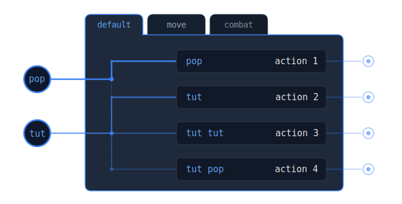
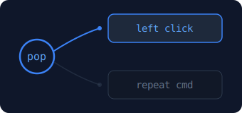

# Talon Input Map



This is an alternate way to define your noises, parrot, foot pedals, face gestures, or other input sources in a way that supports:
- combos
- mode switching
- throttling
- debounce
- variable inputs
- greater than or less than for `power`, `f0`, `f1`, `f2`, `x`, `y`, or `value`

## Installation

Clone this repo into your [Talon](https://talonvoice.com/) user directory:

```sh
# mac and linux
cd ~/.talon/user

# windows
cd ~/AppData/Roaming/talon/user

git clone https://github.com/rokubop/talon-input-map/
```

## Table of Contents
- [Talon Input Map](#talon-input-map)
  - [Installation](#installation)
  - [Usage - simple](#usage---simple)
  - [Modes](#modes)
  - [Options](#options)
  - [Legend](#legend)
  - [Events](#events)
  - [Mode actions](#mode-actions)
  - [Channels](#channels---multiple-input-maps-at-the-same-time)
  - [Single actions](#single-actions)
  - [Testing](#testing)
  - [Dependencies](#dependencies)

## Usage - simple

1. Call `user.input_map_handle` from a talon file.
    ```talon
    parrot(pop): user.input_map_handle("pop")
    ```

2. Define your input map in a python file and return it in a context action.
    ```py
    input_map = {
        "pop": ("click", lambda: actions.mouse_click(0)),
        "tut": ("cancel", lambda: actions.key("escape")),
        "tut tut": ("close window", lambda: actions.key("alt+f4")),
    }
    ```

3. Pass that input map to the context action:
    ```py
    @ctx.action_class("user")
    class Actions:
        def input_map():
            return input_map
    ```

## Modes

Instead of a flat input map, use a dict of modes where keys are mode names:

```py
input_map = {
    "default": {
        "pop": ("click", lambda: actions.mouse_click(0)),
        "tut": ("cancel", lambda: actions.key("escape")),
    },
    "combat": {
        "pop": ("attack", lambda: actions.mouse_click(1)),
        "tut": ("block", lambda: actions.user.game_key("q")),
    },
}
```

Switch modes:
```py
actions.user.input_map_mode_set("combat")
```

The `"default"` key is required — it's how input map detects that modes are being used, and it's the initial mode on startup. Use `{**base, ...}` to inherit from a base mode and override specific inputs. See [all mode actions](#mode-actions).

## Single



If you don't need a full input map and just want mode switching for one or two inputs:

```py
pop_map = {
    "click":  ("left click", lambda: actions.mouse_click(0)),
    "repeat": ("repeat",     lambda: actions.core.repeat_command(1)),
}

@mod.action_class
class Actions:
    def my_pop():
        """handle pop"""
        actions.user.input_map_single("pop", pop_map)
```
```talon
parrot(pop): user.my_pop()
```
```py
actions.user.input_map_single_mode_set("pop", "repeat")
```

Each name has independent state. See [all single actions](#single-actions).

## Options

**Basic**
```talon
parrot(pop): user.input_map_handle("pop")
```
```py
"pop": ("click", lambda: actions.mouse_click(0)),
```

**Combo**
```talon
parrot(pop):   user.input_map_handle("pop")
parrot(cluck): user.input_map_handle("cluck")
```
```py
"pop":       ("click", lambda: actions.mouse_click(0)),
"pop cluck": ("combo", lambda: actions.mouse_click(2)),  # pop delayed 300ms waiting for cluck
```

**Throttle / Debounce**
```talon
parrot(hiss):      user.input_map_handle("hiss")
parrot(hiss:stop): user.input_map_handle("hiss_stop")
```
```py
"hiss:th_90":       ("scroll", lambda: actions.user.scroll_down()),  # at most once per 90ms
"hiss_stop:db_100": ("stop",   lambda: None),                       # wait 100ms before stopping
```
Use `":th"` or `":db"` for defaults.

**Variable pattern**
```talon
parrot(tut): user.input_map_handle("tut")
```
```py
"tut $noise": ("reverse", lambda noise: actions.user.reverse(noise)),  # captures next input
```

**Condition (power, f0, f1, f2)**
```talon
parrot(pop): user.input_map_handle_parrot("pop", power, f0, f1, f2)
```
```py
"pop:power>10": ("loud click", lambda: actions.user.strong_click()),
"pop:else":     ("soft click", lambda: actions.mouse_click(0)),
```
Requires `input_map_handle_parrot` to access `power`, `f0`, `f1`, `f2`. Operators: `>`, `<`, `>=`, `<=`, `==`, `!=`.

**Condition (gaze)**
```talon
face(gaze_xy): user.input_map_handle_xy("gaze", gaze_x, gaze_y)
```
```py
"gaze:x<-0.5": ("look left",  lambda x, y: actions.user.aim_left(x, y)),
"gaze:x>0.5":  ("look right", lambda x, y: actions.user.aim_right(x, y)),
"gaze:else":   ("neutral",    lambda: None),
```
Requires `input_map_handle_xy` for `x`, `y`. Adding `else` makes it edge-triggered — fires once per region transition instead of every event.

**Condition (face value)**
```talon
face(dimple_left:change): user.input_map_handle_value("dimple_left", value)
```
```py
"dimple_left:value>0.5": ("ability on",  lambda: actions.user.activate()),
"dimple_left:else":      ("ability off", lambda: actions.user.deactivate()),
```
Requires `input_map_handle_value` for `value`.

**Bool (noise start/stop)**
```py
noise.register("hiss", lambda active: actions.user.input_map_handle_bool("hiss", active))
```
```py
"hiss":      ("scroll", lambda: actions.user.scroll_down()),
"hiss_stop": ("stop",   lambda: None),
```
Maps `True` to `"hiss"`, `False` to `"hiss_stop"`.

**Composing modifiers**

Conditions, throttle, and debounce can be combined:
```py
"pop:power>10:th_100": ("throttled loud click", lambda: actions.user.strong_click()),
```

---

## Legend

Get a `{input: label}` dict for the current mode — useful for building HUDs or debug displays:
```py
legend = actions.user.input_map_get_legend()
# {"pop": "click", "tut": "cancel"}
```

Modifiers are stripped and empty labels are filtered out.

## Events

Listen to every input that fires through input map:
```py
def on_input(event: dict):
    print(event["input"], event["label"], event["mode"])

actions.user.input_map_event_register(on_input)
actions.user.input_map_event_unregister(on_input)
```

Works globally across input map, channels, and singles.

## Mode actions

```py
actions.user.input_map_mode_set("combat")
actions.user.input_map_mode_cycle()
actions.user.input_map_mode_revert()
actions.user.input_map_mode_get()
```

## Channels - multiple input maps at the same time

Instead of the context approach, you can use channels to have multiple input maps active at the same time. Each channel is registered by name and processes inputs independently.

1. Register channels from a python file:
    ```py
    navigation_map = {
        "pop": ("select", lambda: actions.mouse_click(0)),
        "hiss:th_100": ("scroll", lambda: actions.user.scroll_down()),
    }
    combat_map = {
        "cluck": ("attack", lambda: actions.mouse_click(0)),
        "cluck cluck": ("heavy attack", lambda: actions.mouse_click(1)),
    }

    actions.user.input_map_channel_register("navigation", navigation_map)
    actions.user.input_map_channel_register("combat", combat_map)
    ```

2. Route inputs to channels from a talon file:
    ```talon
    parrot(pop):        user.input_map_channel_handle("navigation", "pop")
    parrot(hiss):       user.input_map_channel_handle("navigation", "hiss")
    parrot(cluck):      user.input_map_channel_handle("combat", "cluck")
    ```

3. Channels support modes, events, bool handlers, and all the same features:
    ```py
    actions.user.input_map_channel_mode_set("combat", "defensive")
    actions.user.input_map_channel_mode_cycle("combat")
    actions.user.input_map_channel_mode_revert("combat")
    actions.user.input_map_channel_unregister("combat")
    ```

## Single actions

```py
actions.user.input_map_single_mode_set("pop", "repeat")
actions.user.input_map_single_mode_cycle("pop")
actions.user.input_map_single_mode_revert("pop")
actions.user.input_map_single_mode_get("pop")
actions.user.input_map_single_get_legend("pop", pop_map)
```

Map formats — just callables, with labels, or expanded for combos/modifiers:
```py
# Just callables
pop_map = {
    "click":  lambda: actions.mouse_click(0),
    "repeat": lambda: actions.core.repeat_command(1),
}

# With labels
pop_map = {
    "click":  ("left click", lambda: actions.mouse_click(0)),
    "repeat": ("repeat",     lambda: actions.core.repeat_command(1)),
}

# Expanded — for combos/modifiers
pop_map = {
    "click": {
        "pop":     ("click",        lambda: actions.mouse_click(0)),
        "pop pop": ("double click", lambda: actions.mouse_click(0, 2)),
    },
}
```

## Testing

To run the test suite, open the Talon REPL and run:

```python
actions.user.input_map_tests()
```

## Dependencies
none
