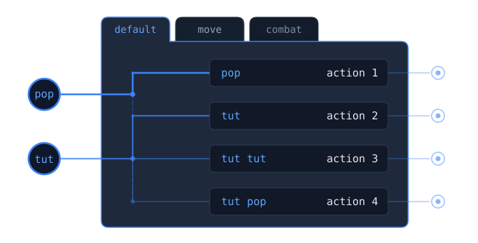
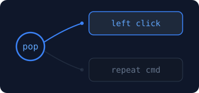

# Talon Input Map



This is an alternate way to define your noises, parrot, foot pedals, face gestures, or other input sources in a way that supports:
- combos
- mode switching
- throttling
- debounce
- variable inputs
- greater than or less than for `power`, `f0`, `f1`, `f2`, `x`, `y`, `value`, or `dur`
- tap vs hold, via `dur`
- delayed follow-up actions
- bindings scoped to the moment a mode is entered
- cross-input modifiers

> Formerly known as `parrot_config`.

## Installation

Clone this repo into your [Talon](https://talonvoice.com/) user directory:

```sh
# mac and linux
cd ~/.talon/user

# windows
cd ~/AppData/Roaming/talon/user

git clone https://github.com/rokubop/talon-input-map/
```

## Features

```py
"pop":                ("click",   lambda: actions.mouse_click(0))        # basic
"pop cluck":          ("combo",   lambda: actions.mouse_click(2))        # combo
"pop:now":            ("start",   lambda: actions.user.start())          # combo prefix, fire now too
"pop:after_100":      ("hop",     lambda: actions.user.hop())            # 100ms later, unless a combo wins
"hiss:th_90":         ("scroll",  lambda: actions.user.scroll_down())    # throttle 90ms
"hiss_stop:db_100":   ("stop",    lambda: None)                          # debounce 100ms
"tut $noise":         ("reverse", lambda noise: reverse(noise))          # variable
"pop:power>10":       ("loud",    lambda: actions.user.strong_click())   # condition
"pop:else":           ("soft",    lambda: actions.mouse_click(0))        # fallback
"left_up:dur<300":    ("tap",     lambda: actions.user.tap())            # held under 300ms
"left_up:dur>=300":   ("hold",    lambda: actions.user.hold())           # held 300ms or more
"pop:power>10:th_100":("burst",   lambda: actions.user.strong_click())   # compose
"hiss:init":          ("redirect",lambda: actions.user.other_mode())     # first 300ms of a mode
"pedal + pop":        ("R click", lambda: actions.mouse_click(1))        # cross-input modifier
```

[Modes](#modes) | [Single](#single) | [Options](#options) | [Now](#now) | [After](#after) | [Init window](#init-window) | [Duration](#condition-duration) | [Cross-input modifier](#cross-input-modifier) | [Edge debounce](#edge-debounce) | [Settings](#settings) | [Legend](#legend) | [Events](#events) | [Channels](#channels---multiple-input-maps-at-the-same-time)

## Table of Contents
- [Talon Input Map](#talon-input-map)
  - [Installation](#installation)
  - [Features](#features)
  - [Table of Contents](#table-of-contents)
  - [Usage - simple](#usage---simple)
  - [Modes](#modes)
  - [Single](#single)
  - [Options](#options)
  - [Legend](#legend)
  - [Events](#events)
  - [Mode actions](#mode-actions)
  - [Other actions](#other-actions)
  - [Channels - multiple input maps at the same time](#channels---multiple-input-maps-at-the-same-time)
  - [Single actions](#single-actions)
  - [Testing](#testing)
  - [Dependencies](#dependencies)
  - [More Talon packages](#more-talon-packages)

## Usage - simple

1. Call `user.input_map_handle` from a talon file.
    ```talon
    parrot(pop): user.input_map_handle("pop")
    ```

2. Define your input map in a python file and return it in a context action.
    ```py
    input_map = {
        "pop": ("click", lambda: actions.mouse_click(0)),
        "tut": ("cancel", lambda: actions.key("escape")),
        "tut tut": ("close window", lambda: actions.key("alt+f4")),
    }
    ```

3. Pass that input map to the context action:
    ```py
    @ctx.action_class("user")
    class Actions:
        def input_map():
            return input_map
    ```

## Modes

Instead of a flat input map, use a dict of modes where keys are mode names:

```py
input_map = {
    "default": {
        "pop": ("click", lambda: actions.mouse_click(0)),
        "tut": ("cancel", lambda: actions.key("escape")),
    },
    "combat": {
        "pop": ("attack", lambda: actions.mouse_click(1)),
        "tut": ("block", lambda: actions.user.game_key("q")),
    },
}
```

Switch modes:
```py
actions.user.input_map_mode_set("combat")
```

The `"default"` key is required - it's how input map detects that modes are being used, and it's the initial mode on startup. Use `{**base, ...}` to inherit from a base mode and override specific inputs. See [all mode actions](#mode-actions).

## Single



If you don't need a full input map and just want mode switching for one or two inputs:

```py
pop_map = {
    "click":  ("left click", lambda: actions.mouse_click(0)),
    "repeat": ("repeat",     lambda: actions.core.repeat_command(1)),
}

@mod.action_class
class Actions:
    def my_pop():
        """handle pop"""
        actions.user.input_map_single("pop", pop_map)
```
```talon
parrot(pop): user.my_pop()
```
```py
actions.user.input_map_single_mode_set("pop", "repeat")
```

Each name has independent state. See [all single actions](#single-actions).

## Options

**Basic**
```talon
parrot(pop): user.input_map_handle("pop")
```
```py
"pop": ("click", lambda: actions.mouse_click(0)),
```

**Combo**
```talon
parrot(pop):   user.input_map_handle("pop")
parrot(cluck): user.input_map_handle("cluck")
```
```py
"pop":       ("click", lambda: actions.mouse_click(0)),
"pop cluck": ("combo", lambda: actions.mouse_click(2)),  # pop delayed 300ms waiting for cluck
```
Combo window is `user.input_map_combo_window` (300ms default).

**Now**
```py
"pop:now":   ("jump start", lambda: actions.user.jump_start()),
"pop pop":   ("full jump",  lambda: actions.user.full_jump()),
```
A combo prefix normally waits out the combo window before firing. `:now` fires it immediately and still tracks the combo.

**After**
```py
"pop:now":       ("jump start", lambda: actions.user.jump_start()),
"pop:after_100": ("short hop",  lambda: actions.user.short_hop()),
"pop pop":       ("full jump",  lambda: actions.user.full_jump()),
```
`:after_100` fires 100ms after the input. Cancelled if a combo consumes that input, so single pop is a short hop and double pop is a full jump. Repeating the input reschedules it. Pairs with `:now` for "act instantly, commit later unless something else arrives".

**Throttle / Debounce**
```talon
parrot(hiss):      user.input_map_handle("hiss")
parrot(hiss:stop): user.input_map_handle("hiss_stop")
```
```py
"hiss:th_90":       ("scroll", lambda: actions.user.scroll_down()),  # at most once per 90ms
"hiss_stop:db_100": ("stop",   lambda: None),                       # wait 100ms before stopping
```
Use `":th"` or `":db"` for defaults.

**Init window**
```py
"hiss:init": ("canvas scale",  lambda: actions.user.canvas_scale()),
"hiss":      ("canvas resume", lambda: actions.user.canvas_resume()),
```
Use `hiss:init` to declare how hiss should behave if triggered within `300ms` of activating the input map mode.

Writing `hiss:init` is the same as writing `hiss:init_300` (user setting).

`hiss:init_1000` means within the first `1000ms` of activating the input map mode, `hiss` will behave according to the `init_1000` definition.

Cannot be combined with `":else"`.
Pair `":init"` with a plain unconditioned key, as above.

**Variable pattern**
```talon
parrot(tut): user.input_map_handle("tut")
```
```py
"tut $noise": ("reverse", lambda noise: actions.user.reverse(noise)),  # captures next input
```

**Condition (power, f0, f1, f2)**
```talon
parrot(pop): user.input_map_handle_parrot("pop", power, f0, f1, f2)
```
```py
"pop:power>10": ("loud click", lambda: actions.user.strong_click()),
"pop:else":     ("soft click", lambda: actions.mouse_click(0)),
```
Requires `input_map_handle_parrot` to access `power`, `f0`, `f1`, `f2`. Operators: `>`, `<`, `>=`, `<=`, `==`, `!=`.

**Condition (gaze)**
```talon
face(gaze_xy): user.input_map_handle_xy("gaze", gaze_x, gaze_y)
```
```py
"gaze:x<-0.5": ("look left",  lambda x, y: actions.user.aim_left(x, y)),
"gaze:x>0.5":  ("look right", lambda x, y: actions.user.aim_right(x, y)),
"gaze:else":   ("neutral",    lambda: None),
```
Requires `input_map_handle_xy` for `x`, `y`. Adding `else` makes it edge-triggered - fires once per region transition instead of every event.

**Condition (face value)**
```talon
face(dimple_left:change): user.input_map_handle_value("dimple_left", value)
```
```py
"dimple_left:value>0.5": ("ability on",  lambda: actions.user.activate()),
"dimple_left:else":      ("ability off", lambda: actions.user.deactivate()),
```
Requires `input_map_handle_value` for `value`.

**Condition (duration)**
```talon
parrot(hiss):      user.input_map_handle("hiss")
parrot(hiss:stop): user.input_map_handle("hiss_stop")
```
```py
"hiss_stop:dur<300":  ("brief",     lambda: actions.user.tap()),
"hiss_stop:dur>=300": ("sustained", lambda: actions.user.hold()),
```
`dur` is ms between a start and its `_stop` or `_up` pair, so it only exists on those keys - `hiss_stop`, `left_up`. Tap vs hold, without a timer of your own.

Write it as a set of branches, not a single binding - one `dur` alone leaves every other duration unhandled.

No recorded start means `dur` is `None` and no `dur` condition matches, so a lone `pop` falls through to its plain binding.

**Bool (noise start/stop)**
```py
noise.register("hiss", lambda active: actions.user.input_map_handle_bool("hiss", active))
```
```py
"hiss":      ("scroll", lambda: actions.user.scroll_down()),
"hiss_stop": ("stop",   lambda: None),
```
Maps `True` to `"hiss"`, `False` to `"hiss_stop"`.

**Cross-input modifier**
```py
"pedal_left":           ("hold",    lambda: actions.user.hold_action()),
"pedal_left_stop":      ("release", lambda: actions.user.release_action()),
"pop":                  ("click",   lambda: actions.mouse_click(0)),
"pedal_left + pop":     ("R click", lambda: actions.mouse_click(1)),   # pop while pedal held
```
The left side of `+` is the **modifier** - must be stateful (has a `_stop` pair or if/else edge-triggered conditions). The right side is the **activator** - the discrete event. When the modifier is active, the modifier action fires instead of the normal action. When not active, the normal action fires.

Works with edge-triggered modifiers too:
```py
"gaze:x<-0.5":    ("look left",  lambda: ...),
"gaze:else":       ("neutral",    lambda: ...),
"gaze + pop":      ("gaze click", lambda: actions.mouse_click(1)),  # pop while gaze active (non-else)
```

Conditions on the modifier side target specific regions:
```py
"gaze:x<500 + pop":  ("left click",  lambda: actions.mouse_click(0)),  # pop while gaze x<500
"gaze:x>=500 + pop": ("right click", lambda: actions.mouse_click(1)),  # pop while gaze x>=500
```

**Edge debounce**

Stabilize edge-triggered region transitions to prevent flicker. `user.input_map_edge_debounce_ms` delays the transition by that many ms, so rapid flicker inside the window settles to the final state. `_active_region` keeps the old value meanwhile. Default `0` (off, identical to no debounce).

**Context params**
```py
"pop:power>10":    ("loud", lambda power: actions.user.click(power)),
"gaze:x<-0.5":     ("aim",  lambda x, y: actions.user.aim(x, y)),
"hiss_stop":       ("held", lambda dur: print(dur)),
```
Name context variables as lambda params and they get passed in: `power`, `f0`, `f1`, `f2`, `x`, `y`, `value`, `dur`. All params must be context names, otherwise nothing is injected. Variable patterns use their `$var` params instead.

**Composing modifiers**

Conditions, throttle, and debounce can be combined:
```py
"pop:power>10:th_100": ("throttled loud click", lambda: actions.user.strong_click()),
```
`:after_` is the exception - it keys off the base input only, so conditions and throttle on the same key are ignored.

**Settings**
```talon
settings():
    user.input_map_combo_window = 300     # ms to wait for a combo
    user.input_map_init_window = 300      # window a bare ":init" covers
    user.input_map_edge_debounce_ms = 0   # edge transition debounce, 0 = off
```

---

## Legend

Get a `{input: label}` dict for the current mode - useful for building HUDs or debug displays:
```py
legend = actions.user.input_map_get_legend()
# {"pop": "click", "tut": "cancel"}
```

Empty labels are filtered out. A lone binding shows the bare input. A base with several bindings keeps a readable modifier, so each case gets its own row:

```py
"pop":              ("click", ...),
"left_up:dur<300":  ("tap",   ...),
"left_up:dur>=300": ("hold",  ...),
# {"pop": "click", "left up < 300ms": "tap", "left up >= 300ms": "hold"}
```

`:th`, `:db` and `:now` never show. Same rules for `input_map_channel_get_legend` and `input_map_single_get_legend`.

## Events

Listen to every input that fires through input map:
```py
def on_input(event):
    print(event.input, event.label, event.mode)

actions.user.input_map_event_register(on_input)
actions.user.input_map_event_unregister(on_input)

actions.user.input_map_channel_event_register("combat", on_input)
actions.user.input_map_channel_event_unregister("combat", on_input)
```

Works globally across input map, channels, and singles. The channel variants only see one channel.

## Mode actions

```py
actions.user.input_map_mode_set("combat")
actions.user.input_map_mode_cycle()
actions.user.input_map_mode_revert()
actions.user.input_map_mode_get()
```

## Other actions

```py
actions.user.input_map_get()          # input map dict for the current mode
actions.user.input_map_get("combat")  # for a named mode
actions.user.input_map_reset()        # drop the cache, re-read on the next input
```

Read voice commands out of a `.talon` file, for HUDs that list both noises and commands:
```py
actions.user.input_map_get_talon_commands("talon-game-sheepy/sheepy_game.talon")
# {"jump": 'user.gamekit_button_tap("a")', ...}

actions.user.input_map_get_talon_commands_grouped("talon-game-sheepy/sheepy_game.talon")
# {"WASD": ["go", "back"], "Combat": ["hit", "strong"]}   # grouped by "# Section" comments
```

## Channels - multiple input maps at the same time

Instead of the context approach, you can use channels to have multiple input maps active at the same time. Each channel is registered by name and processes inputs independently.

1. Register channels from a python file:
    ```py
    navigation_map = {
        "pop": ("select", lambda: actions.mouse_click(0)),
        "hiss:th_100": ("scroll", lambda: actions.user.scroll_down()),
    }
    combat_map = {
        "cluck": ("attack", lambda: actions.mouse_click(0)),
        "cluck cluck": ("heavy attack", lambda: actions.mouse_click(1)),
    }

    actions.user.input_map_channel_register("navigation", navigation_map)
    actions.user.input_map_channel_register("combat", combat_map)
    ```

2. Route inputs to channels from a talon file:
    ```talon
    parrot(pop):        user.input_map_channel_handle("navigation", "pop")
    parrot(hiss):       user.input_map_channel_handle("navigation", "hiss")
    parrot(cluck):      user.input_map_channel_handle("combat", "cluck")
    ```

3. Channels support modes, events, bool handlers, and all the same features:
    ```py
    actions.user.input_map_channel_mode_set("combat", "defensive")
    actions.user.input_map_channel_mode_cycle("combat")
    actions.user.input_map_channel_mode_revert("combat")
    actions.user.input_map_channel_mode_get("combat")
    actions.user.input_map_channel_get("combat")
    actions.user.input_map_channel_get_legend("combat")
    actions.user.input_map_channel_list()
    actions.user.input_map_channel_unregister("combat")
    ```

    Channel handlers mirror the global ones:
    ```talon
    parrot(pop):              user.input_map_channel_handle_parrot("combat", "pop", power, f0, f1, f2)
    face(gaze_xy):            user.input_map_channel_handle_xy("combat", "gaze", gaze_x, gaze_y)
    face(dimple_left:change): user.input_map_channel_handle_value("combat", "dimple_left", value)
    ```
    ```py
    noise.register("hiss", lambda active: actions.user.input_map_channel_handle_bool("combat", "hiss", active))
    ```

## Single actions

```py
actions.user.input_map_single_mode_set("pop", "repeat")
actions.user.input_map_single_mode_cycle("pop")
actions.user.input_map_single_mode_revert("pop")
actions.user.input_map_single_mode_get("pop")
actions.user.input_map_single_get_legend("pop", pop_map)
```

Handlers mirror the global ones, taking the map as the second arg:
```py
actions.user.input_map_single_parrot("pop", pop_map, power, f0, f1, f2)
actions.user.input_map_single_xy("gaze", gaze_map, x, y)
actions.user.input_map_single_value("dimple_left", dimple_map, value)
actions.user.input_map_single_bool("hiss", hiss_map, active)
```

Map formats - just callables, with labels, or expanded for combos/modifiers:
```py
# Just callables
pop_map = {
    "click":  lambda: actions.mouse_click(0),
    "repeat": lambda: actions.core.repeat_command(1),
}

# With labels
pop_map = {
    "click":  ("left click", lambda: actions.mouse_click(0)),
    "repeat": ("repeat",     lambda: actions.core.repeat_command(1)),
}

# Expanded - for combos/modifiers
pop_map = {
    "click": {
        "pop":     ("click",        lambda: actions.mouse_click(0)),
        "pop pop": ("double click", lambda: actions.mouse_click(0, 2)),
    },
}
```

## Testing

To run the test suite, open the Talon REPL and run:

```python
actions.user.input_map_tests()
```

## Dependencies
none

## More Talon packages
Check out my other Talon packages for UI, mouse control, parrot, and more at [talon-hub-roku](https://github.com/rokubop/talon-hub-roku).
